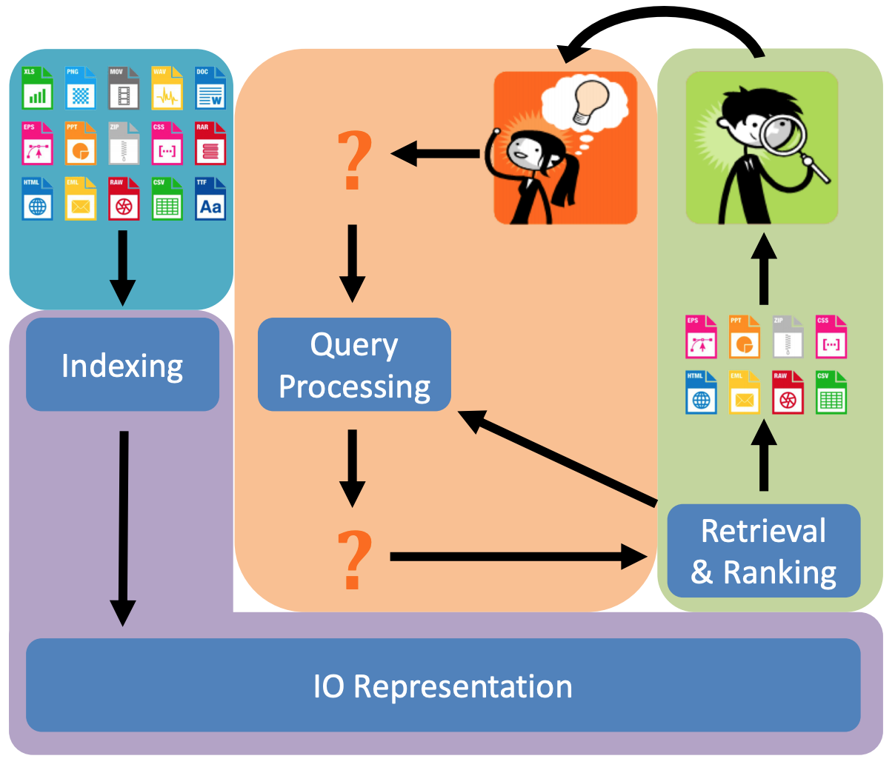
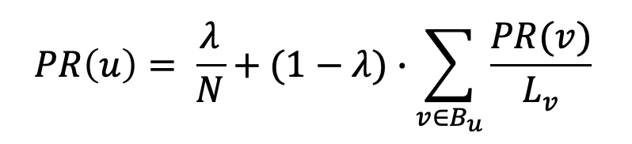
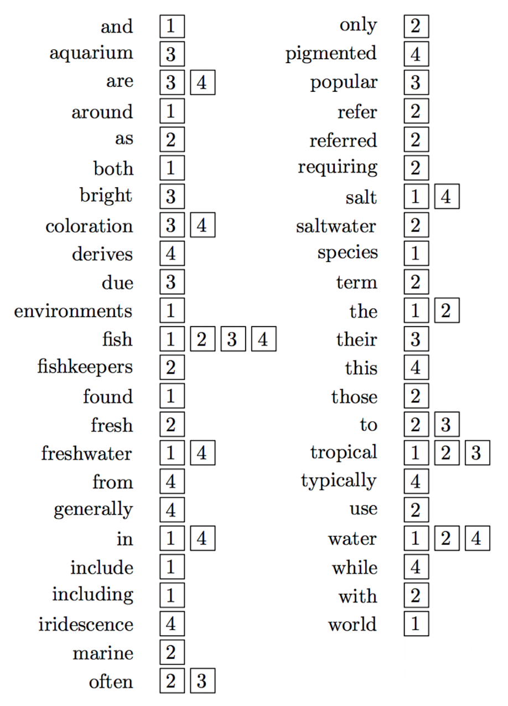
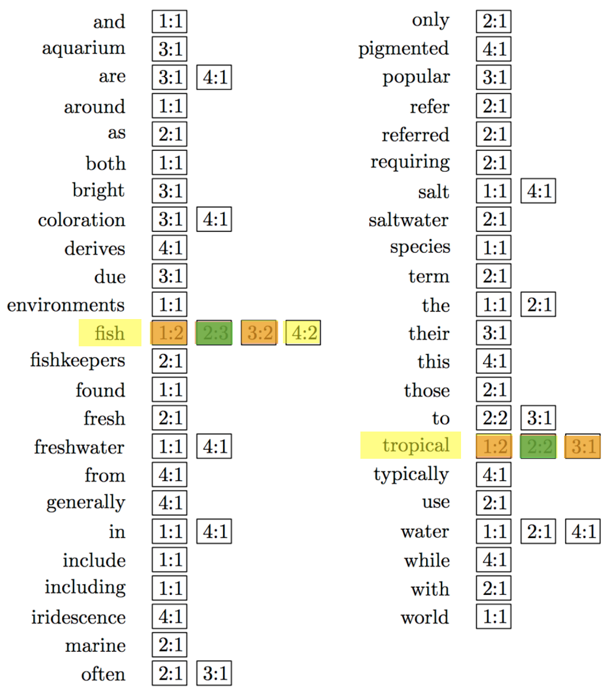
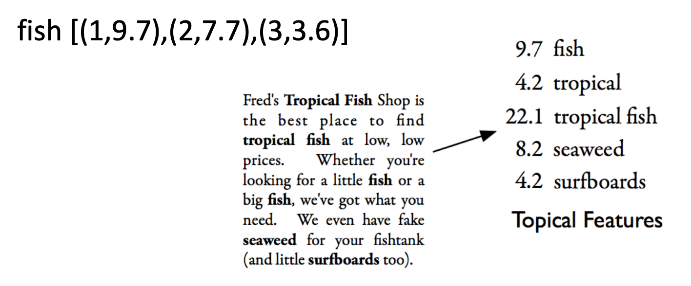
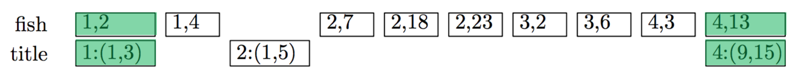
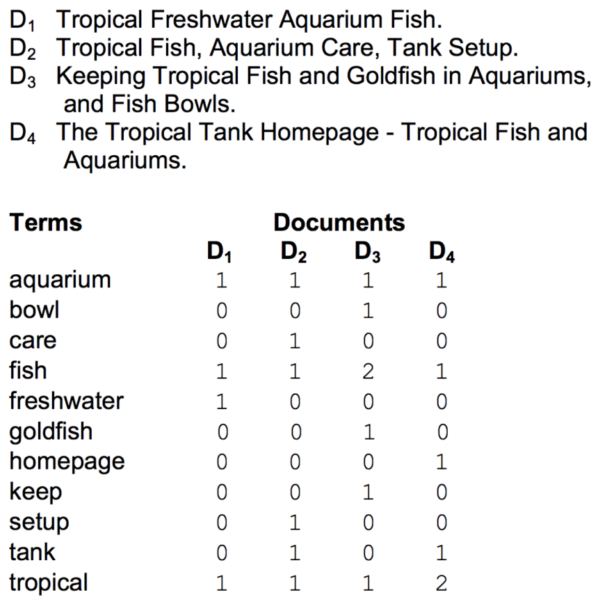
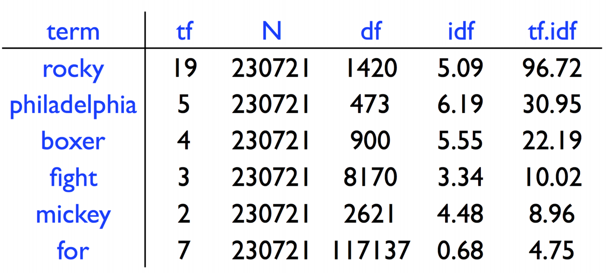

*(https://github.com/nating/personal-notes/blob/master/fifth-year/information-retrieval-and-web-search/all-notes.md)*

# All Notes

## Introduction

* Principals of Information Retrieval and Web Search include:
  * Text Processing and Indexing
  * Web Retrieval and Link Analysis
  * Retrieval models and Ranking
  * Evaluation of IR
  * Personalised, Entity Driven and Semantic IR
  * Advanced Approaches, e.g.:
    * Language Models
    * Word Embeddings
    * Machine Learning

* The Information Life Cycle involves:
  * Creation
  * Searching
  * Utilisation

* Organising information objects involves:
  * Organising
  * Indexing
  * Storing

* Finding information objects involves:
  * Retrieval
  * Accessing
  * Filtering

* Information retrieval is a field concerned with the structure, analysis, organisation, storage, searching, and retrieval of information.

* Up till now, the primary focus of IR has been on text and documents.

* Information objects can include:
  * Books, Journals
  * Articles, Reports
  * Web Pages
  * Office Documents
  * Pictures Graphics
  * Audio or Video Files
  * Blogs, RSS Feeds

* Document representation refers to using a **surrogate** to represent documents. These surrogates may include abstracts, key words, and index terms.

* Full-Text retrieval is retrieval that does not use surrogates. It uses the full text of each document.

* In searches like SQL:
  * There are definitive results.
  * It returns the complete set of data that meets the criteria.
  * There is no estimation of relevancy.

* The **Structure of IR Systems** is as follows:
  * Information objects are obtained.
  * The information objects are represented / indexed.
  * A User provides an information request.
  * There is an attempt to match the request against the information objects.
  * A list of recommended information objects that match this request is provided.

* This is an image of the structure of an IR system:

* **Postulates of Impotence** means to assume the existence of helplessness. In the context of this module, and why IR is hard, it means that an information need cannot be expressed independent of context.

* Other things that make IR hard include:
  * It is impossible for a machine to translate a request into adequate search terms.
  * A document's relevance depends on other seen documents.
  * It is never possible to verify whether all relevant documents have been found.
  * Machines cannot recognise meaning.

* There are issues with users making their query:
  * Verbalising their information needs
  * Understanding Query Syntax
  * Understanding Search Engines

* Queries can be:
  * Underspecified, e.g. "giant"
  * Ambiguous, e.g. "jaguar"
  * Represent different informational needs, e.g. answer to a question / background search

* Information is often dynamic, being constantly updated (like twitter, or other feeds).

* Scalability is an issue for IR, as there is becoming more and more information to search over.

* New media is evolving that is difficult to search over.

* A **Relevant Document** contains the information that a person was looking for when they submitted a query to the search engine.

* **Retrieval Models** define a view of relevance.

* **Ranking Algorithms** are based on retrieval models.

* **Evaluation** is a big problem in IR because it is difficult to evaluate the performance of an IR system.

* Evaluation of IR systems typically uses a test collection of documents, queries, and relevance judgements.

* The **Trec Collections** are the most commonly used test collections.

* **Recall** & **Precision** are two examples of effectiveness measures.

* Information is a big business. Alphabet have a market value of $813 Billion.

## Web Crawling

* Data on the web is heterogenous. There are multiple types of media, multiple languages. This requires multimodal indexing and search.

### Web Search Challenges

* Speed of the web's expansion:
  * Crawling and indexing
  * Web page update frequency
  * Dynamic page generation
  * Invisible, Deep, or Dark web

* Quality of the data
  * 1 in 200 words have typos

* SEO (which is referred to as 'search engine spamming')

---

* **Web Crawling** refers to browsing the web in a methodical manner, collating a list of links discovered.

* A Web Crawler is also known as a **Web Spider** or **Web Robot**.

* A Web Crawler is given seed URLs to start from and it recursively harvests links from websites it visits from there.

* There are numerous crawling algorithms.

* A **URI** is a Uniform Resource Identifier, which is unique to a resource.

* Every page on the internet has a **URI**.

* A **URL** is a type of URI which also specifies the access mechanism (protocol) that can be used to obtain the resource.

* Web pages are stored on web servers that use HTTP to exchange information with client software.

* `http` and `https` are **Schemes**.

* `www.scss.tcd.ie` is a **Hostname**.

* `/personnel/intelligent-systems.php` is a **Resource**.

* **DNS** stands for Domain Name System.

* **IP** stands for Internet Protocol.

* A DNS server translates a hostname into an IP address.

* A Web Crawler connects to a DNS server, finds out the IP address of the resource, connects to the machine with that IP address on a specific port, and makes a request with a specific protocol for the resource it wants.

* Crawlers use threads to fetch hundreds of pages at once.

* **Politeness Policies** are delays that crawlers use between making more requests to the same web server.

* **Robots.txt** files are used to control crawlers.

* **Focused Crawling** involves only downloading pages that are about a specific topic.

* In focused crawling, popular pages about a topic are typically used as seeds.

* A **Text Classifier** is used by a crawler to determine whether a page is 'on-topic'.

* The **Deep Web** is pages that are difficult for web crawlers to find.

* There are three broad categories of pages on the deep web:
  * Private sites (no incoming links, or need login)
  * Form results (need the submission of data to arrive at)
  * Scripted pages (pages that use a client side scripting language to generate links)

* **Darknets**  are overlay networks on the web which use the Internet but require specific software, configurations or authorisation to access.

* The **Dark Web** is parts of web that exist on **Darknets**.

* The Dark Web forms a small part of the deep web.

* Examples of darknets include tor, freenet, and I2P.

* **Sitemaps** contain lists of URLs and data about those URLs, such as modification time and modification frequency.

* Sitemaps can tell crawlers about pages they may otherwise not find, and give them an idea of how often those pages change.

* Some search engines treat 'social content' differently than other content. (e.g. whether they show tweets in search results.)

* A **Spider Trap** (or crawler trap) is a set of web pages that may intentionally or unintentionally be used to cause a web crawler or search bot to make an infinite number of requests or cause a poorly constructed crawler to crash.

* Challenges for Web Crawling include:
  * Selection of which links to follow. (Crawling algorithm, & Link Analysis)
  * When to revisit pages.
  * Deep or invisible web.
  * Parallelisation.
  * Network and Server overload.
  * Spider Traps.

## Link Analysis

* **Link Analysis** gives search engines an idea of how pages relate to each other.

* The page relationships found in link analysis help search engines rank pages more effectively.

* Link Analysis gives an idea of how popular a web page is.

* Components involved in the analysis of a link are:
  * Hyperlink
  * Anchor Text
  * Linking page
  * Linked-to page

* There are numerous algorithms for link analysis.

* Two popular link analysis algorithms are **HITS** and **PageRank**.

* Anchor Text is one of the strongest signals in web search.

* The two or three words usually in anchor text often succinctly describe the topic of the linked page.

* Queries are often very similar to anchor text.

*  All anchor text in all links pointing to a page is typically added to the index as an additional field.

* As anchor text is generally not written by the author of the page, it can describe the linked page from an independent, or
different perspective.

* The simplest approach of link analysis is to count the number of incoming links to a page and use this as a popularity measure, but this method is susceptible to spam.

* **Hyperlink Algorithms** are link analysis algorithms which assume:
  * The quality of a page is proportional to the quality of the pages that link to it.
  * The popularity of a page is proportional to the number of pages that link to it.
  * Popular pages are more likely to contain relevant information than unpopular pages.

* Using hyperlink algorithms, **Link** measures are generated for each page and used in ranking.

#### Hubs, Authorities, and HITS

* The idea of hubs and authorities assumes that if 'Page A' links to 'Page B', then the author of 'Page A' recommends 'Page B'.

* An **Authority** is a page that is linked to by many influential pages in a subject area.

* A **Hub** is a page that links to many influential pages in a subject area.

* A **Good Authority** is linked to by many good hubs.

* A **Good Hub** links to many good authorities.

* **HITS** stands for Hyperlink Induced Topic Selection.

* HITS is a link analysis algorithm that works of the idea of hubs and authorities.

* In HITS:
  * Popular pages can become Hubs or Authorities.
  * The Quality of hubs and authorities is based on the pages that link to them.
  * Each hub and authority is checked often to make sure it has maintained its importance.

* The HITS algorithm involves a series of iterations of three steps:
  * Update each node's Authority Score to be the sum of the hub scores of each node that points to it.
  * Update each node's Hub Score to be the sum of the authority scores of each node it points to.
  * Normalise all the hub / authority scores by dividing them by the square root of the sum of the squares of all the other hub / authority scores.

* The HITS algorithm starts with each node having a hub score and authority score of 1, and then begins the iterations.

#### PageRank

* **PageRank** is a link analysis algorithm that computes the score of a page as the probability of visiting that page.

* In PageRank, a page has a high rank if the sum of the ranks of pages pointing at it is high.

* The steps involved in PageRank:
  * A number, 𝑟, between 0 and 1 is chosen.
  * If 𝑟 < ⋋, the "surprise me" button is clicked.
  * If 𝑟 ≥ ⋋ lambda, a random link on the current page is clicked.
  * Start again.

* PageRank is an example of an ergodic Markov Chain.

* The algorithm for the PageRank of a page is:

*where N is the number of pages, Bu is the set of pages that point to u, and Lv is the number of outgoing links from page v (not counting duplicate links).*

* Search engines that use PageRank will prefer pages with high PageRank values, instead of assuming that all web pages are equally likely to satisfy a query.

* HITS calculates authority and hub values for a subset of pages retrieved by a given query.

# Indexing

* **IO** can stand for Information Object.

* **Indexing** is representing the information in IOs so that they can be found with user queries.

* Each search engine has its own indexing strategy.

* **Automatic Indexing** is building indexes and retrieving information without human intervation.

* Indexes are used to determine the relevance of a document to a user query.

* Text-based indexing involves deducing the terms that best describe the content of documents.

* **Description** is describing the content of IOs as well as possible, recognising which IOs are relevant to the user, and showing the user *all* relevant IOs.

* **Discrimination** is seeing the differences between IOs, and showing the user *only* relevant IOs.

* Good document representation is a balance of description and discrimination.

* There are two main measures of **Indexing Effectiveness**:
  * Index Exhaustivity (how well all subject matter in the document is recognised and represented in the information system)
  * Term Specificity (how broad the terms describing the document are) (broad terms will return many documents, narrow terms will return less)

### Components of Indexing

* **Tokenisation** is dividing a document into terms (or words).

* **Term Normalisation** is normalising terms, such as:
  * Converting to upper or lowercase
  * Removing hyphens or punctuation

* **Stop Word Removal** is removing commonly occurring words.

* A **Stop List** is a list of words used for Stop Word Removal.

* Most words in stop lists are based on term frequency, but some other terms that add no descriptive value to the document may also be added, e.g. "say", "small", "very".

* There can be a problem with stop words, when they are essential to a query, e.g. "to be or not to be".

* **Stemming** is reducing the variation in words. e.g. turning "walker", "walking", "walked", and "walks" all into "walk".

* Stemming is used to *"conflate morphologically similar words"*.

* A typical stemmer consists of rules and/or dictionaries.

* Examples of stemmers are Porter, Snowball (Porter 2), and KSTEM.

* Problems with stemming include:
  * It can introduce terms that are not real words: "Iteration" -> "Iter".
  * It can miss connections: "European" - "Europe".
  * It can make false connections: "Universe" - "Universal" - "University".
  * It may not recognise proper nouns: "Thomas" - "Thoma".

* **Term Weighting** is deciding which terms best describe a document.

* The text processing used for queries must be the same as is used for documents. e.g. If the word "walking" has been converted to "walk" in all the indexes, then the word "walking" in a query should also be converted to "walk" so that those terms match.

* Zipf's Law is that in a corpus of natural language utterances, the frequency of any word is roughly inversely proportional to its rank in the frequency table.
  * Zipf's Law: `r * f = Constant`. *where r is the rank of a word in the frequency table, and f is its frequency*

* Zipf's Law translates to the most common word occurring twice as often as the second, which occurs twice as often as the third.. etc.

* Zipf's Law can be used to determine the probability of the occurrence of a word:
  * `r * Pr = c` *where Pr is the probability of the rth ranked word in the frequency table occurring, and c is a constant*
  * In English, the constant *c* is approximately 0.1.

* Zipf's law is quite accurate but loses accuracy at high ranks in practice.

* High frequency words are useless, **very** low frequency words may useless (spelling mistakes, or too rare), and the most discriminative words are of the middle frequency.

* Methods based on Zipf's Law are:
  * Stop Word Removal: remove most frequent words
  * Significant words: remove most and least frequent words (rarely used)
  * Term Weighting: weight terms by their frequency (used by almost all search engines)

* Phrases are important for search engines. e.g."Climbing equipment" should have the occurrences of the terms together rated higher.

* **POS** stands for Parts of Speech.

* A POS tagger is used to label words as a certain part of speech: NN (singular noun), NNS (plural noun), VB (verb), VBD (verb, past tense)... etc.

* Using a POS tagger, phrases can be identified based on POS tags.

* POS tagging is too slow for web search.

* An **n-gram** is a sequence of *n* words.

* The more frequently an n-gram occurs, the more likely it is to correspond to a meaningful phrase in the language.

* The rank frequency for n-grams fits Zipf's distribution better than singular words.

|||
|---|---|
|Stemming|Description|
|Stop Word Removal|Discrimination|

# Ranking and Indexes

* **Inverted Index** is an umbrella term for a range of data structure used for text search.

* An inverted index is like an index found at the back of a book. The word "Inverted" is used because rather than words being associated with documents, documents are associated with words.

* Index terms in inverted indexes are often alphabetised, though they need not be as they are indexed using a hashtable.

* In an inverted index of a search engine, each entry may have a key of a term and a value of a list of the documents that use the term or a list of the occurrences of the term.

* Each list entry in an index of an inverted index is called a **posting**.

* The part of a posting that refers to a specific document or occurrence is called a **pointer**.

* Each document in a collection is given a unique number in order to make it efficient to store document pointers.

* The simplest form of an inverted index just stores the documents that contain each word:

* Each list in an inverted index is ordered by sentence number.

* Because each list in an inverted index is ordered by sentence number, finding the an intersection of two lists is `O(max(m,n))` *(where m is the length of the first list and n is the length of the second)*.

* Inverted indexes can be extended to take into account term frequency within a document.

* Inverted indexes can be further extended by taking into account the position of terms within a document, for further discrimination and phrase identification.

* Adding feature weighting to inverted indexes also further extends them.

* Special classes of documents have custom sections, such as a subject and body in an email. These are instances of **Document Fields**.

* **Document Fields** are sections of documents that carry semantic meaning.

* Rules and weighting for document fields can be integrated into the ranking function.

* An **Extent** is a contiguous region of a document. It can be encoded like (<the index of the first term in the extend>,<the index after the last term in the extent>) *(indexing from 1)*.

* Posting lists and extent lists can be combined to figure out what section of a document terms occur:

* Documents in the above example inverted indexes have all been ordered by number, but they can also be ordered by score / weight for each term, which can be useful for certain queries (such as ones that include only one word).

* Some other indexing challenges include:
  * Compression and Memory Management
  * Adding data
  * Updating data
  * Index merging
  * Document deletion
  * Distributed indexing

# Query Processing

* Some web search challenges include:
  * Different styles and skill levels of users
  * Personalisation
  * Heterogenous Data (multimodal and multilingual search)
  * Spoken / Conversational search

* The basic query processing techniques are **Document-at-a-Time** and **Term-at-a-Time**.

* Document-at-a-time query processing gets a score for each document, one at a time:

* Term-at-a-time query processing gets a score for each document for each term, and then adds all those scores up:

* The primary disadvantage of term-at-a-time is the memory required by the accumulator.

* Term-at-a-time reads each inverted list from start to finish, so it has more efficient disk access.

* Neither document-at-a-time or term-at-a-time is used without extra optimisations.

* The two main optimisations for query processing are:
  * Read less data from the index
  * Process fewer documents

* Which type of optimisation to be used for query processing is based on the feature functions. For complex feature functions, less documents should be scored. For simpler feature functions, as much of the inverted lists as possible should be ignored.

* Query Processing **Optimisation Techniques** include:
  * List Skipping
  * Conjunctive Processing
  * Threshold Methods
  * MaxScore
  * Early Termination
  * List Ordering

TODO: this is explained terribly
* **Skip Lists** (or **Skip Pointers**) are useful when looking for list intersections. If LA has docs 1, 4, and ,18 and LB has docs 1, 3, 10, 11, and 19 there is no point in checking that 10 and 11 intersect, so they can be skipped.

* List skipping in practice has very little effect on disk accessing but does save in processing time.

* **Conjunctive Processing** involves only considering documents that contain all the terms of a query.

* Conjunctive Processing can be added to both document-at-a-time and term-at-a-time. It works best when the first list is shortest and the last list is longest, as this makes the skip distances in the last list the longest (where they will be most beneficial).

* Here is pseudo-code from Seamus for Conjunctive processing:

* No document that has a score less than the kth document is ever shown to the user. This score is called 𝜏 (the **Threshold**).

* Query processing could be optimised if 𝜏 was known, but it cannot without fully processing the query. Its approximation, 𝜏', is used instead.

* In document-at-a-time, 𝜏' is the score of the lowest scoring document currently in R.

* In term-at-a-time, 𝜏' is the score of the kth highest scoring accumulator in A.

* By using 𝜏', parts of inverted lists that will not generate a score above 𝜏' can be ignored.

* In **Max Score**, a partial score is found for a common part of the query, e.g. scores for the word 'tree' are calculated first. Then 𝜏' is set as the kth lowest score from *the first three* documents that contain all the words.

* **Early Termination** means not doing all of the processing that would usually be done, to save time.

* In term-at-a-time, some terms that are very frequent may not be considered (words that usually aren't stop words are considered as stop words).

* In term-at-a-time, after *x* postings, the other postings may not be considered as the rank could be well established.

* In document-at-a-time, the documents at the end of inverted lists may be ignored, but if this is the case the documents have to be ordered by some quality metric.

* **List Ordering** refers to terminating query processing early because the documents in the inverted lists are decreasing in quality and will not get any higher.

# Boolean Retrieval, VSM, and tf-idf

* Retrieval models are *the mathematical foundation upon which ranking algorithms are based*.

* Two aspects of relevance that are looked at in this module are:
  * Topical vs User
  * Binary vs Multivalued

* A document is **Topically Relevant** if it is judged to be on the same topic.

* **User Relevance** is what an individual user believes to be relevant.

* **Binary Relevance** is that a document is either relevant or not relevant.

* **Multivalued Relevance** is where relevance is a multivalued variable.

* Retrieval models include:
  * Boolean Retrieval
  * Vector Space Model
  * Probabilistic Models (BM25)
  * Language Models
  * Machine Learning

* **Boolean Retrieval** (or *exact-match-retrieval*) is where all documents retrieved are equivalent in terms of relevance.

* Boolean Retrieval requires users to be able to make their specific queries ("president AND lincoln AND NOT (nebraska OR cars)").

* Using the NOT operator in queries is not recommended, because e.g. a user won't know that the Wikipedia page for Abraham Lincoln has "Nebraska" in it.

* In Boolean Retrieval, all query terms have the same importance.

* In the **Vector Space Model**, documents and queries are considered to be vectors of length *t* in a *t*-dimensional vector space. *(where t is the number of index terms)*

* In VSM, a collection of *n* documents can be considered a matrix of *n* rows which represent documents and *t* columns which represent weights assigned to a term for a document.

* The Vector Space Model can implement term weighting, ranking, and user feedback.

* In VSM, the angle of the vectors is used, rather than their euclidean distance. This is because documents that have different lengths differ a lot in their euclidean distance. A+A and A may have a large euclidean distance between them, but they have the same angle.

* In VSM the angle of the document vectors and the query vector is used to rank the documents.

* Ranking documents in decreasing order of the angle between the query and document is the same as ranking documents in increasing order of cosine(query,document).

* **Cosine Correlation** is the angle between two vectors:

* **TF-IDF** stands for Term-Frequency - Inverse Document Frequency.

* tf-idf is the most common term weighting scheme used by VSM.

* **TF** (*term-frequency*) determines the importance of a term in a document or q query. TF is usually the number of occurrences of the term in the document.

* **IDF** (*inverse-document-frequency*) determines the importance of a term across a collection of documents.

* IDF is calculated with `idf = log(N/nk)`. *where N is the number of documents in the corpus, and nk is the number of documents that contain term k.*

**NOTE: To get the right calculations to match those in Seamus' notes, use 'ln()' on your calculator instead of 'log()'.**

* VSM is typically used as a model of topical relevance.

# Probabilistic Retrieval - BM25

* The **Probability Ranking Principle** *(roughly)* states that if an IR system ranks documents in decreasing relevance to a user's query, based on the probabilities that they are relevant (using whatever data is available), the overall effectiveness is the best it can do with the data made available. *(🤷‍♂️)*

* The notation **P(A|B)** means: The probability of A *given* B.

* In an IR system that assumes binary relevance, a document is relevant if P(R|D) > P(NR|D).

* P(R|D) > P(NR|D) is known as a **Bayes Decision Rule** and a system that classifies documents this way is known as a **Bayes Classifier**.

TODO: I got lost at *Bayes* tbh

# Language Models

* A **Language Model** is a way of representing text in a language model.

* The simplest language model is a probability distribution over the words in a language.

* A **Discrete Random Variable** describes an event with a *finite* (e.g. discrete) number of outcomes and a degree of *uncertainty* (e.g. random).

* A **Probability Distribution** is the probability of each possible outcome of a random variable.

* In a probability distribution:
  * All probabilities are between 0 and 1.
  * All probabilities add up to 1.

* If each outcome is independent of previous outcomes, the probability of a sequence of outcomes occurring is calculated by multiplying the probabilities of the individual outcomes occurring.

* An n-gram model predicts a word based on the previous (n-1) words.

* In a **Unigram Language Model**, none of the previous words have an effect on the next word.

* Two important steps in language modelling are:
  * Estimation: Observing text and estimating the probability of each word.
  * Prediction: Using the language model to assign a probability to some text.

* A topic can be thought of as a language model where some words have a probability of occurring, i.e. a **Topic Model**.

* Topic models have probabilities for every single word, but words not really to do with the topic have default probabilities that will be the same for any topic.

* A **Multinomial Distribution** is where each point in the sequence has *multiple* possible values.

* A **Query Likelihood Retrieval Model**, ranks documents by the probability that the query text could be generated by the document language model. ( `P(Q|D)` )

* Here is the formula used by the Query Likelihood Retrieval model in using the Unigram Language Model:

* A problem with the idea of query likelihood retrieval model is that words that don't occur in a document would have a probability of zero and if a single query term is not in a document, its score will be zero.

* **Smoothing** is used to increase the probability of unobserved outcomes and decrease the probability of observed outcomes.

* **Discounting** is an idea in smoothing where, for example, probabilities of 0/20 are increased to 1/20 so that there are not serious errors from calculations. This is called **Add-one Smoothing**.

* **Linear Interpolation Smoothing** uses the probability of a word occurring across the entire collection in its calculation to counteract the problem of a word not appearing in a single document.

* The probability that the document language model gives to a term *t* which is in position *i* of query *q* is:

*where αD is a coefficient controlling the probability assigned to unseen words.*

* The coefficient αD is usually set to a constant, ⋋.

* Overall, the above smoothing techniques add up to the following formula which is known as the **Jelinek-Mercer Method**. This is an estimate of the probability of a term occurring in a document in *Query Likelihood Ranking with linear interpolation smoothing*.

* Small values of ⋋ produce less smoothing.

* As ⋋ approaches 1, the query acts more like a Boolean OR.

TODO: Had to stop and focus on other modules' material round here
