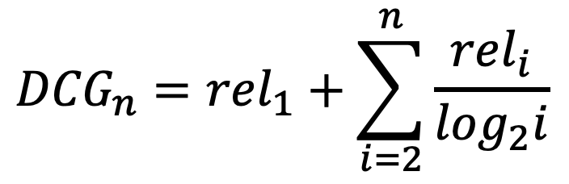

*(https://github.com/nating/personal-notes/blob/master/fifth-year/information-retrieval-and-web-search/evaluation.md)*

# Evaluation

* One measure of search engine performance is the rank of the first relevant document. If the rank of the first relevant document in A's results is 3 and in B's results is 5, then A is deemed better on this metric.

* **Precision** is the number of relevant documents retrieved over the number of documents retrieved.

* **Precision@n** is the same as precision, except the results are truncated at n.

* **Recall** is the number of relevant documents retrieved over the total number of relevant documents.

* **Recall@n** is the same as recall, except the results are truncated at n.

* **F Measure** is the harmonic mean of Recall and Precision. e.g. `2RP/(R + P)`

* **Average Precision** is the average of the precision@n values from rank positions where relevant documents were retrieved.

* **Mean Average Precision** is the Average Precision across multiple queries.

* **Discounted Cumulative Gain** (DCG) gives a value for how useful it is to add the next document in the retrieved documents. Relevance is graded e.g. from 0-3:

*where reli is the graded relevance of document i.*

* An **Ideal Discounted Cumulative Gain** occurs when the documents retrieved are in the correct order, in terms of their graded relevance.

* A **Normalized Discounted Cumulative Gain** is the **Discounted Cumulative Gain** over the **Ideal Discounted Cumulative Gain**.

* Three types of search engine evaluation are:
  * Batch Evaluation: e.g. Trec Eval
  * User-Study Evaluation: Get users in and give them retrieval tasks, then ask them how well it performs
  * Online Evaluation: A/B test with your existing user-base (if you are as popular as e.g. Google/Bing/Yahoo/Yahbingle)

* The **Cold Start Problem** refers to something like how you can't A/B test your search engine to make it good until you have a lot of users.

# Evaluation

* One measure of search engine performance is the rank of the first relevant document. If the rank of the first relevant document in A's results is 3 and in B's results is 5, then A is deemed better on this metric.

* **Precision** is the number of relevant documents retrieved over the number of documents retrieved.

* **Precision@n** is the same as precision, except the results are truncated at n.

* **Recall** is the number of relevant documents retrieved over the total number of relevant documents.

* **Recall@n** is the same as recall, except the results are truncated at n.

* **F Measure** is the harmonic mean of Recall and Precision. e.g. `2RP/(R + P)`

* **Average Precision** is the average of the precision@n values from rank positions where relevant documents were retrieved.

* **Mean Average Precision** is the Average Precision across multiple queries.

* **Discounted Cumulative Gain** (DCG) gives a value for how useful it is to add the next document in the retrieved documents. Relevance is graded e.g. from 0-3:

*where reli is the graded relevance of document i.*

* An **Ideal Discounted Cumulative Gain** occurs when the documents retrieved are in the correct order, in terms of their graded relevance.

* A **Normalized Discounted Cumulative Gain** is the **Discounted Cumulative Gain** over the **Ideal Discounted Cumulative Gain**.

* Three types of search engine evaluation are:
  * Batch Evaluation: e.g. Trec Eval
  * User-Study Evaluation: Get users in and give them retrieval tasks, then ask them how well it performs
  * Online Evaluation: A/B test with your existing user-base (if you are as popular as e.g. Google/Bing/Yahoo/Yahbingle)

* The **Cold Start Problem** refers to something like how you can't A/B test your search engine to make it good until you have a lot of users.
