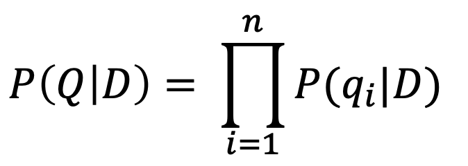

*(https://github.com/nating/personal-notes/blob/master/fifth-year/information-retrieval-and-web-search/language-models.md)*

# Language Models

* A **Language Model** is a way of representing text in a language model.

* The simplest language model is a probability distribution over the words in a language.

* A **Discrete Random Variable** describes an event with a *finite* (e.g. discrete) number of outcomes and a degree of *uncertainty* (e.g. random).

* A **Probability Distribution** is the probability of each possible outcome of a random variable.

* In a probability distribution:
  * All probabilities are between 0 and 1.
  * All probabilities add up to 1.

* If each outcome is independent of previous outcomes, the probability of a sequence of outcomes occurring is calculated by multiplying the probabilities of the individual outcomes occurring.

* An n-gram model predicts a word based on the previous (n-1) words.

* In a **Unigram Language Model**, none of the previous words have an effect on the next word.

* Two important steps in language modelling are:
  * Estimation: Observing text and estimating the probability of each word.
  * Prediction: Using the language model to assign a probability to some text.

* A topic can be thought of as a language model where some words have a probability of occurring, i.e. a **Topic Model**.

* Topic models have probabilities for every single word, but words not really to do with the topic have default probabilities that will be the same for any topic.

* A **Multinomial Distribution** is where each point in the sequence has *multiple* possible values.

* A **Query Likelihood Retrieval Model**, ranks documents by the probability that the query text could be generated by the document language model. ( `P(Q|D)` )

* Here is the formula used by the Query Likelihood Retrieval model in using the Unigram Language Model:

* A problem with the idea of query likelihood retrieval model is that words that don't occur in a document would have a probability of zero and if a single query term is not in a document, its score will be zero.

* **Smoothing** is used to increase the probability of unobserved outcomes and decrease the probability of observed outcomes.

* **Discounting** is an idea in smoothing where, for example, probabilities of 0/20 are increased to 1/20 so that there are not serious errors from calculations. This is called **Add-one Smoothing**.

* **Linear Interpolation Smoothing** uses the probability of a word occurring across the entire collection in its calculation to counteract the problem of a word not appearing in a single document.

* The probability that the document language model gives to a term *t* which is in position *i* of query *q* is:

*where αD is a coefficient controlling the probability assigned to unseen words.*

* The coefficient αD is usually set to a constant, ⋋.

* Overall, the above smoothing techniques add up to the following formula which is known as the **Jelinek-Mercer Method**. This is an estimate of the probability of a term occurring in a document in *Query Likelihood Ranking with linear interpolation smoothing*.

TODO: Insert image

* Small values of ⋋ produce less smoothing.

* As ⋋ approaches 1, the query acts more like a Boolean OR.

TODO: Had to stop and focus on other modules' material round here
