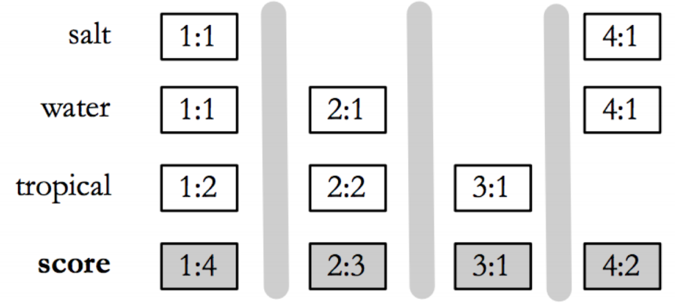
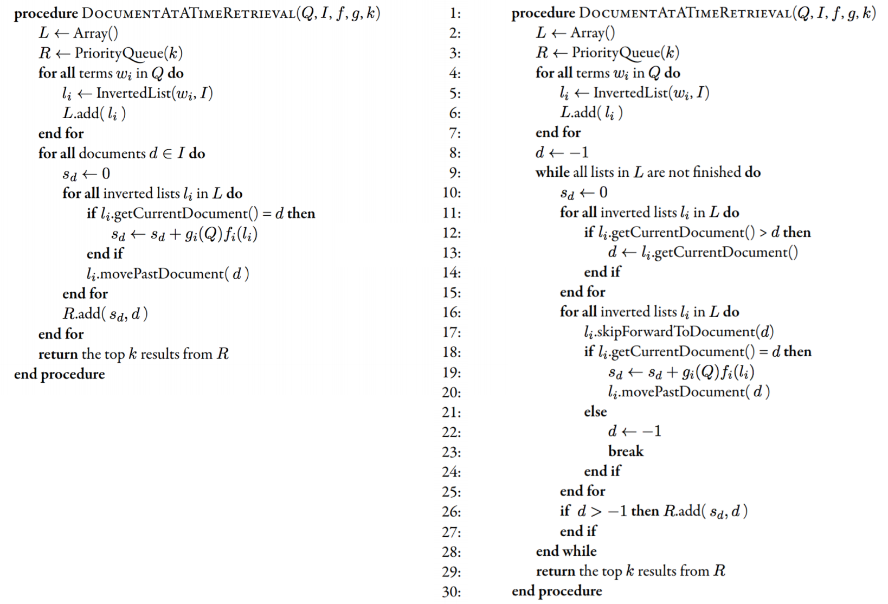
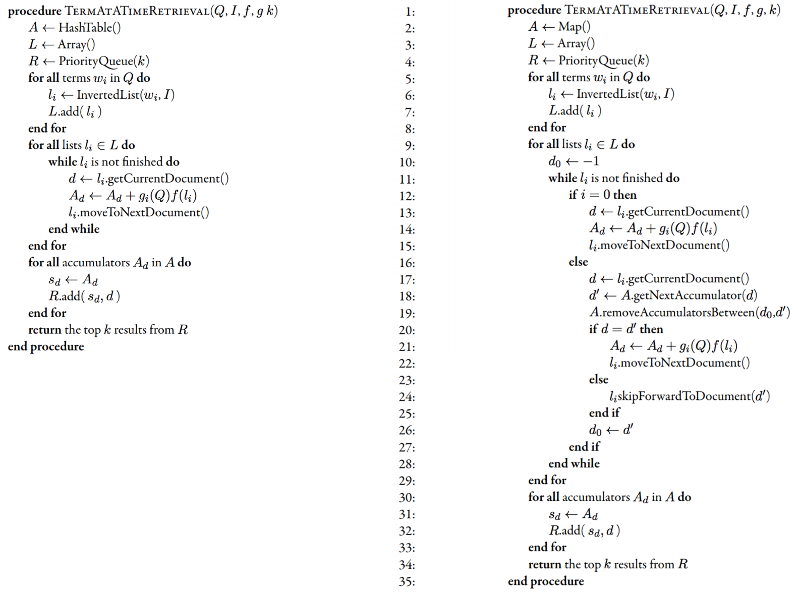

*(https://github.com/nating/personal-notes/blob/master/fifth-year/information-retrieval-and-web-search/query-processing.md)*

# Query Processing

* Some web search challenges include:
  * Different styles and skill levels of users
  * Personalisation
  * Heterogenous Data (multimodal and multilingual search)
  * Spoken / Conversational search

* The basic query processing techniques are **Document-at-a-Time** and **Term-at-a-Time**.

* Document-at-a-time query processing gets a score for each document, one at a time:

* Term-at-a-time query processing gets a score for each document for each term, and then adds all those scores up:

* The primary disadvantage of term-at-a-time is the memory required by the accumulator.

* Term-at-a-time reads each inverted list from start to finish, so it has more efficient disk access.

* Neither document-at-a-time or term-at-a-time is used without extra optimisations.

* The two main optimisations for query processing are:
  * Read less data from the index
  * Process fewer documents

* Which type of optimisation to be used for query processing is based on the feature functions. For complex feature functions, less documents should be scored. For simpler feature functions, as much of the inverted lists as possible should be ignored.

* Query Processing **Optimisation Techniques** include:
  * List Skipping
  * Conjunctive Processing
  * Threshold Methods
  * MaxScore
  * Early Termination
  * List Ordering

TODO: this is explained terribly
* **Skip Lists** (or **Skip Pointers**) are useful when looking for list intersections. If LA has docs 1, 4, and ,18 and LB has docs 1, 3, 10, 11, and 19 there is no point in checking that 10 and 11 intersect, so they can be skipped.

* List skipping in practice has very little effect on disk accessing but does save in processing time.

* **Conjunctive Processing** involves only considering documents that contain all the terms of a query.

* Conjunctive Processing can be added to both document-at-a-time and term-at-a-time. It works best when the first list is shortest and the last list is longest, as this makes the skip distances in the last list the longest (where they will be most beneficial).

* Here is pseudo-code from Seamus for Conjunctive processing:

* No document that has a score less than the kth document is ever shown to the user. This score is called 𝜏 (the **Threshold**).

* Query processing could be optimised if 𝜏 was known, but it cannot without fully processing the query. Its approximation, 𝜏', is used instead.

* In document-at-a-time, 𝜏' is the score of the lowest scoring document currently in R.

* In term-at-a-time, 𝜏' is the score of the kth highest scoring accumulator in A.

* By using 𝜏', parts of inverted lists that will not generate a score above 𝜏' can be ignored.

* In **Max Score**, a partial score is found for a common part of the query, e.g. scores for the word 'tree' are calculated first. Then 𝜏' is set as the kth lowest score from *the first three* documents that contain all the words.

* **Early Termination** means not doing all of the processing that would usually be done, to save time.

* In term-at-a-time, some terms that are very frequent may not be considered (words that usually aren't stop words are considered as stop words).

* In term-at-a-time, after *x* postings, the other postings may not be considered as the rank could be well established.

* In document-at-a-time, the documents at the end of inverted lists may be ignored, but if this is the case the documents have to be ordered by some quality metric.

* **List Ordering** refers to terminating query processing early because the documents in the inverted lists are decreasing in quality and will not get any higher.
